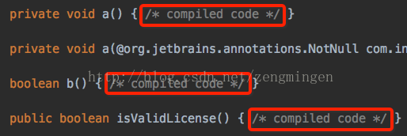
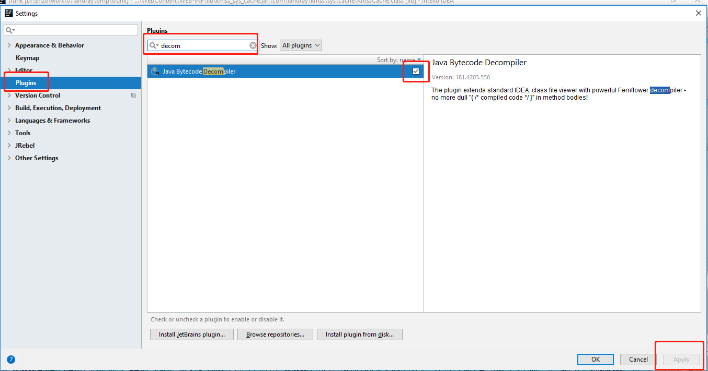

# 编译问题

## A 与JAVA相关

## B 与JDK相关

##  C 与Gradle等构建工具相关

## D 与Spring相关

## E 与IDE相关

 ### e-1编译文件（.class文件）中出现 【/* compiled code */】

当打开class的时候，如果看到方法体是，/* compile code */，这样的的标识的时候，是因为IDEA第一次被打开的是有，有一项权限同意，被否决了，所以，才没有正常反编译，而是使用的JDK的；

解决方法是：

